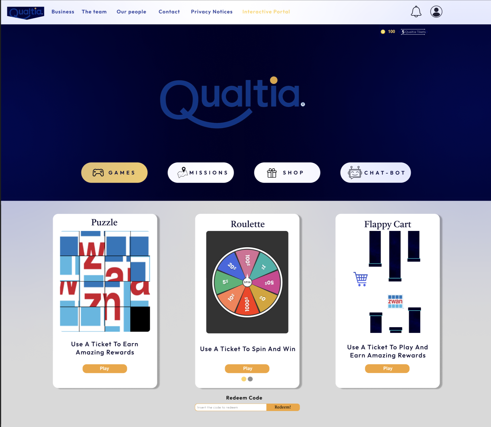

# StudySphere

  

## Purpose

**Qualtia Play** was conceptualized and developed during the **uOttaHack 6 x i-Hack Mty 2024 hackathon** to address the challenge presented by **Qualtia**: attracting more clients and maintaining their loyalty. Recognizing that **Qualtia** sells refrigerated products to markets, our solution leverages gamification and a unique digital currency system to enhance customer engagement and retention.

## Key Features

* **QR Code Integration:** Each Qualtia product contains a QR code that, when scanned, directs customers to the Qualtia Play web page.

* **Gamified Experience:** The platform offers three engaging games - Puzzle, Flappy Cart, and Roulette. Each game provides opportunities for customers to win rewards.
  * **Puzzle:** Solve puzzles to earn tokens and discounts.
  * **Flappy Cart:** Navigate through obstacles to collect coins.
  * **Roulette:** Spin the wheel for a chance to win various prizes.

* **Rewards System**: Customers can redeem tokens for discounts or specific products, enhancing their shopping experience.

* **Mission System:** Daily missions provide additional opportunities to earn rewards, encouraging regular engagement.

* **Quali Bot:** An intelligent bot designed to answer customer queries about the web page, Qualtia products, and more, ensuring a seamless user experience.

## Technology Stack

 ### Front-end:

### Back-end:

### Database:

### AI Integration:

### Game Development:

## Contribution

### For Qualtia:

**Qualtia Play** directly addresses the company's need to increase customer engagement and loyalty. The platform provides a fun and interactive way for customers to connect with Qualtia products beyond the initial purchase. The use of games and rewards not only incentivizes repeat purchases but also fosters a deeper emotional connection with the brand. The inclusion of Quali Bot enhances customer service, providing quick and efficient support to users, further improving their experience.

### For Other Companies:

Qualtia Play serves as a pioneering example for other companies facing similar challenges of customer attraction and retention. The gamified loyalty program can be adapted to various industries, especially those dealing with physical products. By integrating QR codes and digital rewards, companies can create engaging customer experiences that drive repeat business and brand loyalty.

 
## Login/Register
 

# Teacher's Perspective

## Menu/Profile Information/Add Class

  

  

## Ongoing Quizzes

  

## Quizzes Results

  

## Add Quiz

  

## Add Student

  

## Quiz Simulation

  

# Student's Perspective

## Menu/Profile Information

   

## Ongoing Quizzes

  

## Past Quizzes

  

## Quiz Simulator

  

  

## Astro Blast

  

## Tutor AI

  

## Collaborators

* **@ferp03**
* **@SofiaSchneider-dev**
* **@Alejandrocharles**
* **@mirelesDavid**
* **@mnoriega-mx**
* **@SergioVargasDev**

